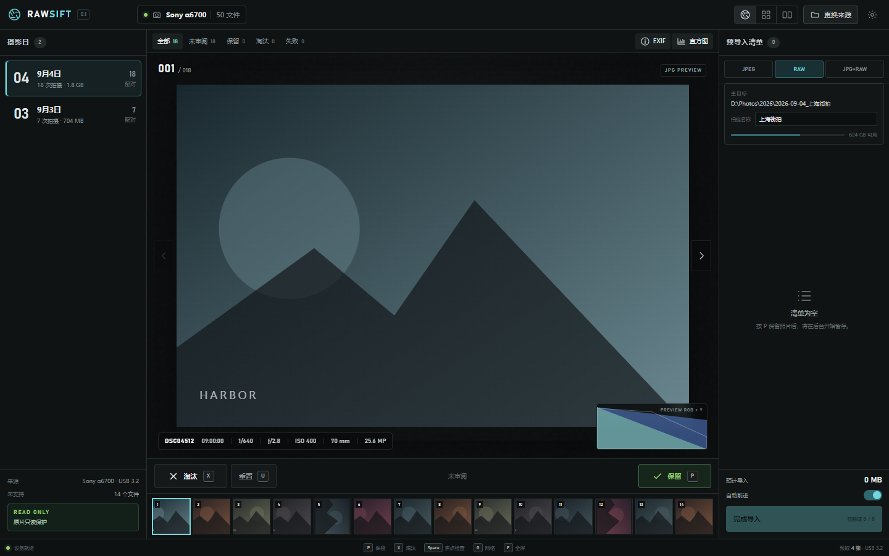

# RawSift

[](LICENSE)
[](https://github.com/MIGO-OvO/RawSift/releases)
[](https://github.com/MIGO-OvO/RawSift/releases)

RawSift is a Windows-first, open-source photo culling and verified-ingest application built with Rust, React, TypeScript, and Tauri.



The project is in active early development. The first hardware target is the Sony α6700. MSC (mass-storage) cameras and card readers support direct ingest; MTP devices are discovered but direct MTP file access is not implemented yet. Sources remain read-only; selected JPEG/ARW files are copied into a destination staging area and must pass a destination-side BLAKE3 readback check before commit.

## Download and installation

Version 0.1.0 installers are published on the [releases page](https://github.com/MIGO-OvO/RawSift/releases). Builds are unsigned early-development previews.

| Platform | Asset |
| --- | --- |
| Windows 10/11 (64-bit) | `RawSift_*_x64-setup.exe` (NSIS) or `RawSift_*_x64_en-US.msi` |
| Windows 10/11 (32-bit) | `RawSift_*_x86-setup.exe` (NSIS) or `RawSift_*_x86_en-US.msi` |
| macOS 10.15+ (Intel and Apple silicon) | `RawSift_*_universal.dmg` |
| Linux (x86_64) | `RawSift_*.deb`, `RawSift-*.rpm`, `RawSift_*.AppImage` |

The Windows installers are per-user and install WebView2 automatically when it is missing.

**macOS note.** The bundle is not code-signed or notarized, so Gatekeeper reports it as damaged after download. Copy the app to `/Applications` and clear the quarantine attribute once:

```bash
xattr -cr /Applications/RawSift.app
```

**Linux note.** The AppImage is portable; mark it executable with `chmod +x RawSift_*.AppImage` before running. Deb and RPM packages install the same binary system-wide.

Installers for every platform are produced by [`.github/workflows/release.yml`](.github/workflows/release.yml), which runs the full build matrix whenever a `v*` tag is pushed.


## Camera discovery and import

On Windows, RawSift probes mounted volumes for DCIM and enumerates portable devices
at startup, then every three seconds after the previous probe finishes. A single
mounted source opens automatically when there is no active or pending saved session.
With multiple devices, choose one from the empty screen or the source menu. New devices
never replace an active review. An unavailable saved session is retained and retried
when its source returns. Source removal is shown without clearing review decisions.
MTP-only devices show connection guidance: switch the camera to MSC or use a card reader.
USB mass-storage aliases exposed through WPD are excluded from the MTP list.

The import confirmation uses `dialog:allow-message` (the command used internally by
the dialog plugin's `confirm`, not a separate confirm permission). Import submission
is locked through confirmation and commit; cancellation/failure unlocks it for retry.

Regression checks: `node tests/import-permissions.mjs`, Rust tests below, and
`node tests/device-import-regression.mjs` with the same Playwright environment settings
as the preview checks. Set `TEST_URL` to the running development server. The device
and import UI test uses mocked IPC; the read-only real-device inventory check is
`cargo test --manifest-path src-tauri/Cargo.toml devices::tests::live_discovery -- --ignored --nocapture`.

## Development

Requirements: Node.js 24+, Rust 1.98+, and the standard Tauri 2 Windows prerequisites.

```powershell
npm install
npm run dev
```

Checks:

```powershell
npm run check
cargo test --manifest-path src-tauri/Cargo.toml
```

See [product decisions](docs/PRODUCT_DECISIONS.md) for the locked scope and safety boundaries.

## Preview controls and regression checks

JPEG EXIF orientation is automatic. Use the visible rotate controls, `R` (right), or
`Shift+R` (left) to rotate locally; this is remembered on this computer and never
changes source or imported files. Hold Space for 100% JPEG inspection, then release
to fit the window. Text fields do not trigger review shortcuts.

Histograms show 256 bins with RGB/brightness and linear/logarithmic modes. Black/white
percentages refer to the sampled JPEG preview, not RAW sensor clipping. Desktop
filmstrip, grid, and queue thumbnails use a 256px maximum edge and a 128-entry
in-memory cache. Histogram analysis waits 140ms for navigation to settle and runs
one decode at a time.

With the web dev server running (`npm run dev:web`) and an existing Playwright
installation available, run `node tests/review-regression.mjs`. If Playwright is
outside this project, set `PLAYWRIGHT_MODULE` to its absolute package directory;
`CHROME_PATH` optionally selects an installed Chromium executable. The checks cover
real JPEG EXIF orientations, fit/rotation, persistence, keyboard focus, window sizes,
and rapid-navigation analysis counts. Visual output is in `artifacts/review-fixed.png`.

## License

RawSift is released under the [MIT License](LICENSE). Copyright (c) 2026 RawSift contributors. Third-party components retain their own licenses.
